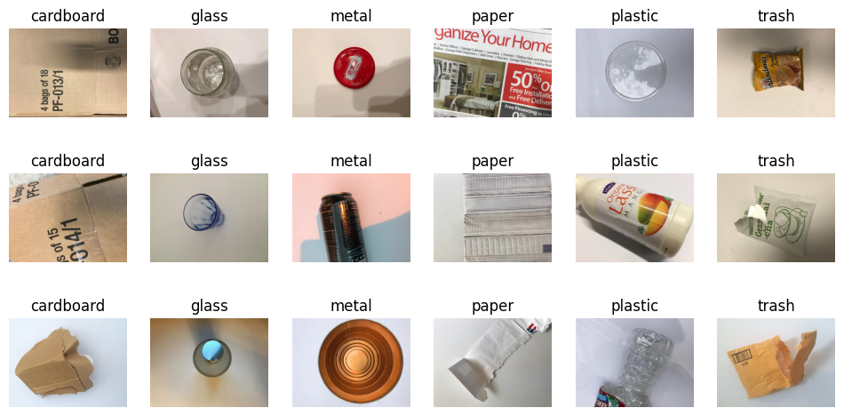

# Sifting Through Trash - Project Repository
*Authors: Reilly Browne, Sai Tanmay Reddy Chakkera, Dylan Scott*

## Project Description
For our [CSE 512](https://sites.google.com/view/sbu-cse512-2023/home) Final Project, we wanted to explore the use of pre-trained machine learning models to classify images of different types of waste. 

We see this technology having clear applications in the real world, as it could be used to sort waste into different categories, which would make recycling more efficient. 

We also found waste classification to be an interesting way to explore Cost-Sensitive Learning, as the cost of misclassifying waste is not the same for each type of waste. For example, a model which often confuses cardboard and paper is not as bad as a model which often confuses plastic and glass (which is a common yet costly mistake). Cost-Sensitive Learning accounts for these imbalance in costs, and we wanted to see how it would affect our model's performance.

## Dataset
We used the [TrashNet](https://github.com/garythung/trashnet) dataset, which contains 2527 images of trash, sorted into 6 categories: cardboard, glass, metal, paper, plastic, and trash. As this is a small dataset, we also used data augmentation to increase the size of our training set.

*Example images from the TrashNet dataset*

We also performed an additional test on the [Fashion MNIST](https://github.com/zalandoresearch/fashion-mnist) dataset, which contains 70,000 images of clothing items, sorted into 10 categories. We wanted to see how our model would perform on a larger dataset, and how it would perform on a dataset with more categories.

## Models
We fine-tuned 3 different pre-trained models for this project:
- [OpenAI's CLIP](https://openai.com/research/clip)
- [Microsoft's ResNet50](https://huggingface.co/microsoft/resnet-50)
- [Google's ViT](https://huggingface.co/google/vit-base-patch16-224)
All models were fine-tuned using the [HuggingFace](https://huggingface.co/) library.

## Cost-Sensitive Learning
For our Cost-Sensitive Learning experiments, we implemented two different loss functions to train our models:
- [Cost-Sensitive Cross Entropy Loss](https://ieeexplore.ieee.org/document/8012579)
- [OVA Regression Loss](https://arxiv.org/pdf/1511.09337.pdf)

## Results
We found that, without Cost-Sensitive Learning, our `vit-base-trash` model had the best performance on the TrashNet dataset, achieving 95.06% test accuracy.

With Cost-Sensitive Learning, we found OVA Regression Loss to be more effective than Cost-Sensitive Cross Entropy Loss. Our `vit-base-trash-csce` model achieved 95.26% test accuracy, while our `vit-base-trash-ovareg` model achieved 96.25% test accuracy on the TrashNet dataset. In our confusion matrix, we noted that while Glass to Plastic stayed the same, Plastic to Glass decreased significantly and Trash to Paper (another common and costly mistake) dropped to 0.00% with both methods.

With Fashion MNIST, our `vit-base-fashion`(trained without Cost-Sensitive Learning) model achieved 93.01% test accuracy, `vit-base-fashion-csce` achieved 93.27% test accuracy, and `vit-base-fashion-csce` achieved 92.63% test accuracy. 

Notably, the worst case in our confusion matrix was when the model predicted a Coat as a Pullover. Without Cost-Sensitive Learning, this happened 11.40% of the time. With CSCE, this happened 8.30% of the time. Then, with OVA Regression, it only happened 5.80% of the time. 

We found that Cost-Sensitive Learning enables significant improvements in model performance, and can be used to reduce the frequency of costly misclassifications.

## Checkpoints
Model checkpoints can be found [here](https://drive.google.com/file/d/1MuoAL3gwFbiwevdBEDHq_xJLZzuDqLCH/view?usp=drive_link) and should be extracted to the `train` folder (this also includes the TrashNet dataset).

*Disclaimer: This file is 11GB in size, as it contains all of the fine-tuned models we trained and evaluated*

## Further Reading
For more information on our project, please see our [final report](https://github.com/dyscott/sifting-through-trash/blob/main/Final-Report.pdf) and our [project poster](https://github.com/dyscott/sifting-through-trash/blob/main/Project-Poster.pdf).

